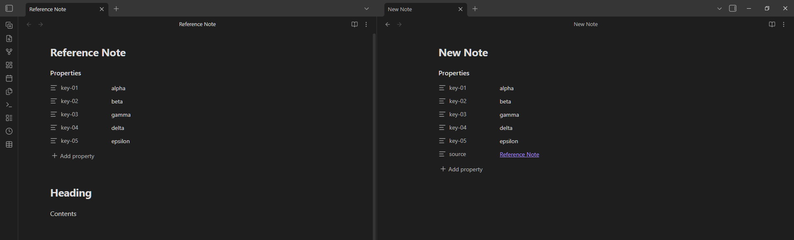
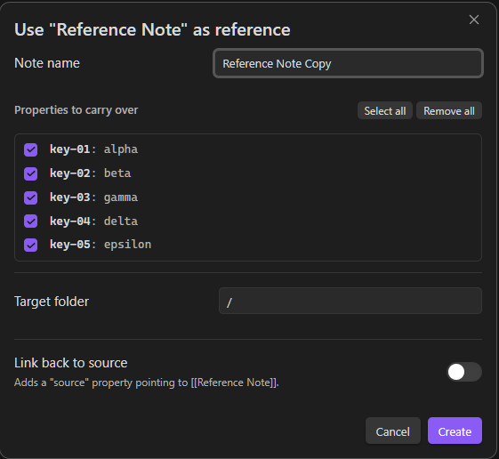
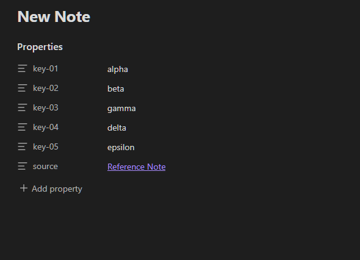
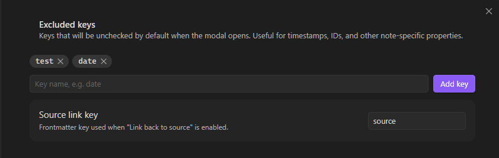

# Reference Note

> Create new notes by cloning properties from any existing note.

---

## What it does

Reference Note lets you use any note as a template.
It copies the properties you choose into a new note. Useful for creating notes that share a same set of properties. So you will not have to manually re-type them every time.

---
## How to use

Three ways to trigger it:

| Trigger | How |
|---------|-----|
| **Ribbon icon** | Click the icon in the left sidebar (works on the currently open note) |
| **Command palette** | Run **"Reference Note: Use this note as reference"** |
| **Right-click menu** | Right-click any `.md` note in the file explorer → **"Use as reference"** |

---

### The modal

After triggering, a modal appears:

- **Note name** — pre-filled with `{source note name} Copy`. Edit it freely.
- **Properties to carry over** — checklist of all properties keys. All checked by default (except keys listed in your "Default excluded keys" setting).
- **Target folder** — searchable input, defaults to the source note's folder.
- **Link back to source** — when enabled, adds a `source: "[[Note Name]]"` property to the new note.

Click **Create** (or press Enter) to create and open the new note. If a note with the same name already exists, a number suffix is appended automatically (`Note Copy 2`, `Note Copy 3`, …).

---

### Result

---

## Settings

Go to **Settings → Community Plugins → Reference Note**.

| Setting              | Default   | Description                                                  |
| -------------------- | --------- | ------------------------------------------------------------ |
| Excluded keys        | *(empty)* | Keys unchecked by default in the modal                       |
| Source link property | `source`  | The property name used for the "Link back to source" feature |

---

## Author

[Rafael Mehdiyev](https://github.com/rafaelmehdiyev)

## License

MIT
